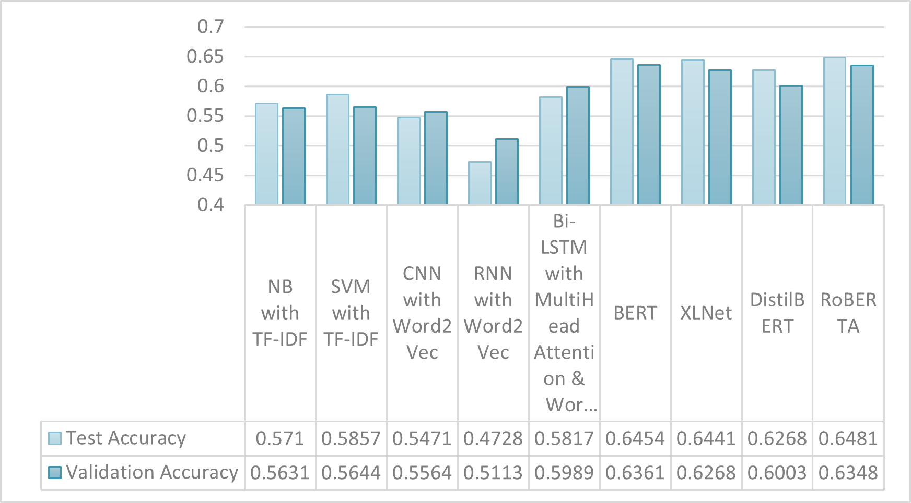
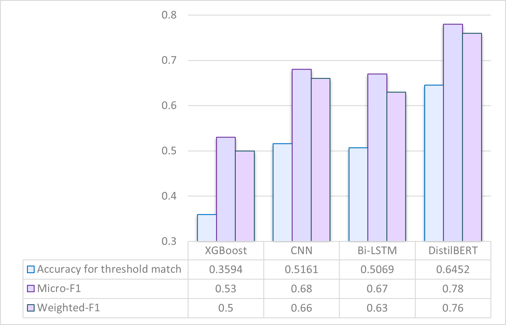

# Emotion Recognition in Text: Enhancing Human-Computer Interaction using AI

<br>

# Installation
1. Clone the repository to local machine:
```
https://github.com/dingxing03/Emotion-Recognition-in-Text.git
```

2. Install the 'requirements.txt':
```
pip install -r requirements.txt
```

# Introduction
Understanding emotions in text is an important part of Natural Language Processing (NLP), as it allows AI to respond more naturally. This project aimed to **develop and evaluate an AI system for real-time emotion classification** using **traditional machine learning, deep learning, and transformer-based models**. Experiments were conducted on two primary datasets: the **single-label ISEAR dataset** and the **multi-label, highly imbalanced GoEmotions dataset**, with additional testing on a **synthetic multilingual corpus**. The results revealed a performance hierarchy: transformers like RoBERTa and DistilBERT outperformed deep learning models, which in turn surpassed traditional classifiers. **DistilBERT** was identified as the most efficient, balancing high accuracy with computational practicality, especially on multilingual text. A functional chatbot prototype integrating DistilBERT and GPT-4 was developed. 

# Dataset
1. ISEAR dataset contains a total of 76666 sentences and 7 emotion labeled: Anger, disgust, fear, sadness, shame, joy, and guilt.
2. GoEmotions dataset contains a total of 58,009 sentences and 27 emotions labeled with neutral.
3. Synthetic multilingual dataset generated using Deepseek and Copilot (with Short Forms & Mixed Emotions)
    - Each emotion categories consist 7-9 text samples
    - Total text samples: 218

# Methodology
- The methodology used for this project involves the following steps:
1. Text Preprocessing: 
    - Lowercasing
    - Expanding contractions
    - Expanding short forms 
    - Removing punctuation, special characters, digits
    - Tokenization
    - Handling negations
    - POS tagging
    - Stemming and Lemmatization
    - Removing stopwords
    - Data augmentation such as synonym replacement
2. Feature Extraction: 
    - Bag of Words
    - TF-IDF
    - N-gram
    - Word Embeddings such as Word2Vec, FastText
3. Model Development and Evaluation: 
    - Machine learning models such as Naive Bayes, Support Vector Machine, XGBoost
    - Deep learning models such as CNN, RNN and Bi-LSTM with attention mechanism
    - Transformer-based models such as BERT, XLNet, DistilBERT, RoBERTa

# Results
<figure>
  
  <figcaption><b>Figure 1:</b> Model performance on ISEAR dataset</figcaption>
</figure>
<br><br>
<figure>
  
  <figcaption><b>Figure 2:</b> Model performance on synthetic dataset after train using GoEmotions dataset</figcaption>
</figure>
<br><br>

- RoBERTa outclassed all models, due to its robust pre-training with dynamic masking and extended training.
- DistilBERT delivered nearly 97% of RoBERTa’s performance with 40% fewer parameters.
- DistilBERT achieved the best performance across all metrics, confirming that transformer models are well-suited for handling noisy real-world text.
- Deep learning models (CNN, Bi-LSTM) outperformed XGBoost, demonstrating a stronger ability to capture subtle semantic patterns in informal and code-switched language.

