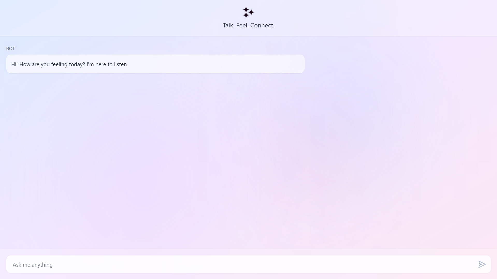
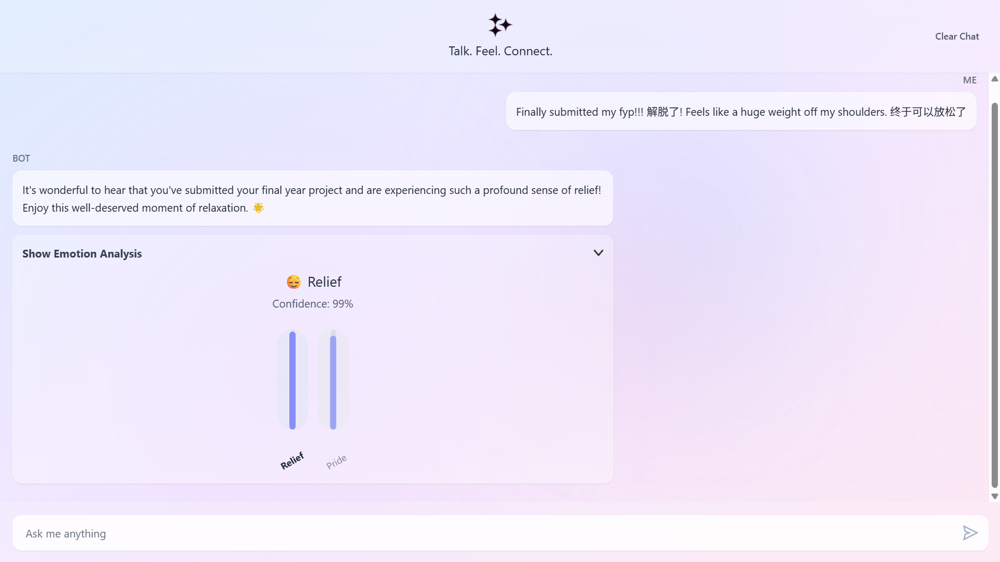
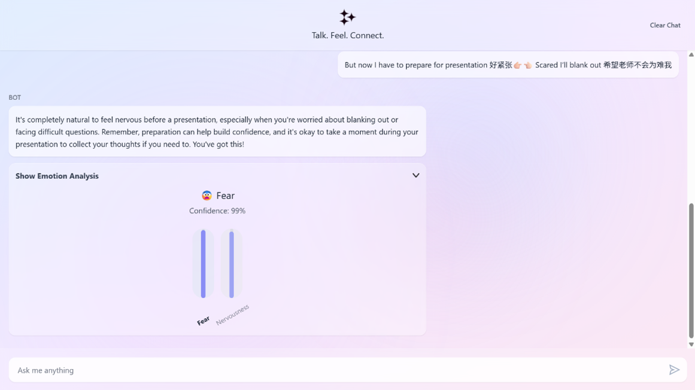

# Emotion Recognition in Text: Enhancing Human-Computer Interaction using AI

<br>

# Installation
1. Clone the repository to local machine:
```
https://github.com/dingxing03/Emotion-Recognition-in-Text.git
```

2. Install the 'requirements.txt':
```
pip install -r requirements.txt
```

3. Start the backend server:
```
python api_server.py
```

4. Open the website (frontend):
```
npm install
npm run dev
Open the app in your browser at: http://localhost:5173/
```

# Introduction
Understanding emotions in text is an important part of Natural Language Processing (NLP), as it allows AI to respond more naturally. This project aimed to **develop and evaluate an AI system for real-time emotion classification** using **traditional machine learning, deep learning, and transformer-based models**. Experiments were conducted on two primary datasets: the **single-label ISEAR dataset** and the **multi-label, highly imbalanced GoEmotions dataset**, with additional testing on a **synthetic multilingual corpus**. The results revealed a performance hierarchy: transformers like RoBERTa and DistilBERT outperformed deep learning models, which in turn surpassed traditional classifiers. **DistilBERT** was identified as the most efficient, balancing high accuracy with computational practicality, especially on multilingual text. A functional chatbot prototype integrating DistilBERT with GNN refiner and GPT-4 was developed. 

**Key Objective:**  
> To develop an AI-based system (chatbot) that can detect and classify real-time emotions from textual data.  
> To implement and compare different emotion recognition techniques to identify the most effective approach for text-based emotion detection.

# Datasets
1. ISEAR dataset contains a total of 76666 sentences and 7 emotion labeled: Anger, disgust, fear, sadness, shame, joy, and guilt.
2. GoEmotions dataset contains a total of 58,009 sentences and 27 emotions labeled with neutral.
3. Synthetic multilingual dataset generated using Deepseek and Copilot contains a total of 218 sentences and 27 emotions.

# Methodology
- The methodology used for this project involves the following steps:
1. Text Preprocessing: 
    - Lowercasing
    - Expanding contractions
    - Expanding short forms 
    - Removing punctuation, special characters, digits
    - Tokenization
    - Handling negations
    - POS tagging
    - Stemming and Lemmatization
    - Removing stopwords
    - Data augmentation such as synonym replacement
2. Feature Extraction: 
    - Bag of Words
    - TF-IDF
    - N-gram
    - Word Embeddings such as Word2Vec, FastText
3. Model Development and Evaluation: 
    - Machine learning models such as Naive Bayes, Support Vector Machine, XGBoost
    - Deep learning models such as CNN, RNN, GNN and Bi-LSTM with attention mechanism
    - Transformer-based models such as BERT, XLNet, DistilBERT, RoBERTa

# Results
<figure>
  
  <figcaption><b>Figure 1:</b> Model performance on ISEAR dataset</figcaption>
</figure>
<br><br>
<figure>
  
  <figcaption><b>Figure 2:</b> Model performance on synthetic dataset after trained using GoEmotions dataset</figcaption>
</figure>
<br><br>

- **RoBERTa outclassed** all models, due to its robust pre-training with dynamic masking and extended training.
- DistilBERT delivered nearly 97% of RoBERTa’s performance with 40% fewer parameters.
- **DistilBERT with GNN refiner achieved the best performance across all metrics**, confirming that transformer models are well-suited for handling noisy real-world text.
- **Deep learning models (CNN, Bi-LSTM) outperformed XGBoost**, demonstrating a stronger ability to capture subtle semantic patterns in informal and code-switched language.

# Chatbot Demonstration

## 1. Chatbot Interface
This is the main interface of the chatbot where users can type their messages and view the emotions detected.

<p align="center">
  
</p>

**Figure 1:** User interface of the chatbot.  

<br>

## 2. Example Conversation
Below is an example interaction between the user and the chatbot, showcasing how the system processes inputs and generates responses based on the emotion detected.

<p align="center">
  
  
</p>

**Figure 2:** Example conversation demonstrating chatbot responses.  

# Conclusion

- High Accuracy:  📊 DistilBERT + GNN refiner achieved 90.32% accuracy
- Broad Support:  🌍 Multilingual💬 Short forms📝 Informal text
- Efficiency:     ⚡ Real-time emotion recognition in code-switched text
> Emotions are complex, with rare emotions like grief often lacking in datasets.
Future work should address data imbalance and explore multimodal approaches such as speech or facial expressions to create a more robust system.
